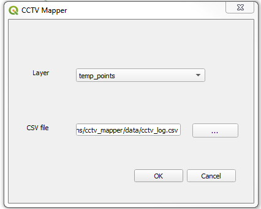

# CCTVMapper
This plugin plots points along lines from a CSV file by matching an ID column in CSV and a line feature ID. The point is plotted based on the digitized direction of the line (pipe) which is assumed to be upstream point to downstream point.  The CSV file needs to have specific column headings, a sample CSV file and a lines shapefile are included.  The primary purpose for its creation was for plotting sanitary sewer pipe inspection data from CCTV projects.  The resulting point file is a memory layer and will need to be saved out another type of format.

To use the plugin you will need a line layer which represents sewer pipes and a CSV file.  Each pipe segment shall have a unique ID.  In the CSV file you will need the following columns

*Pipe ID
*Location
*Start Manhole
*End Manhole
*total_pipe_length
*Surveyed Length
*Pipe Diameter
*Pipe Material
*Direction
*Distance
*Code
*Description
*Clock
*Lateral Size
*Grade
*Comment

Only a few of the columns are needed to plot the points along the pipes.  The other columns are good information to have.

